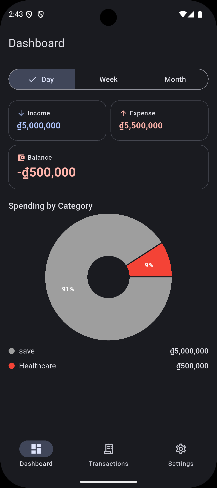
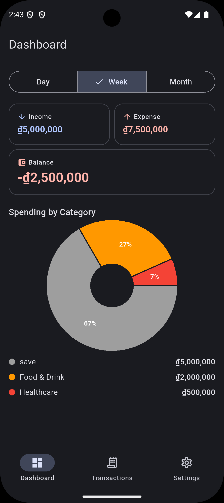
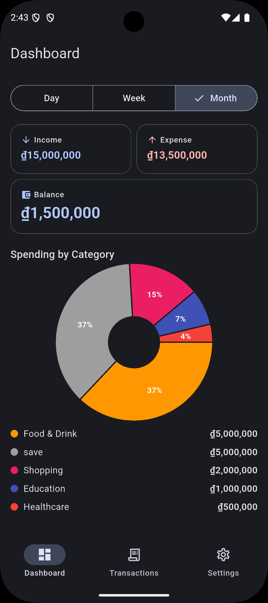
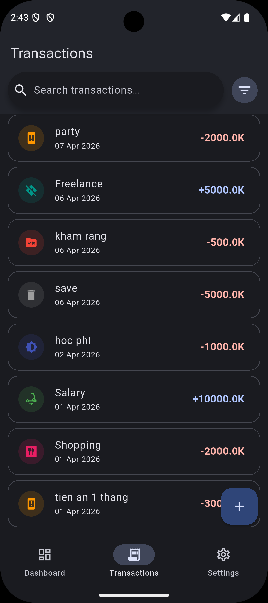
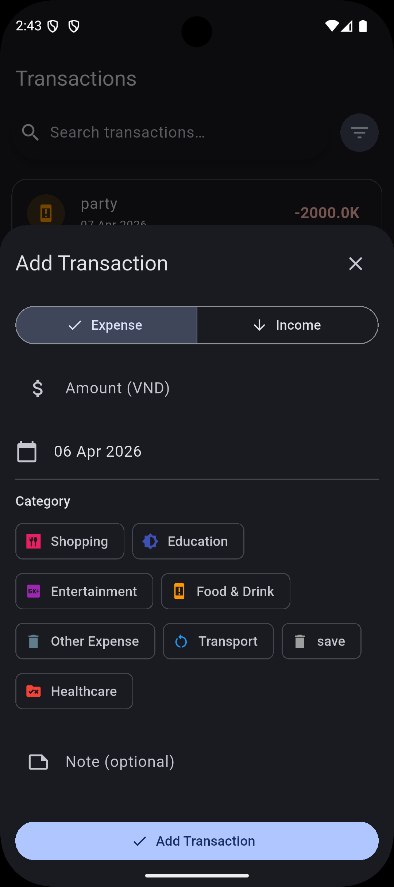
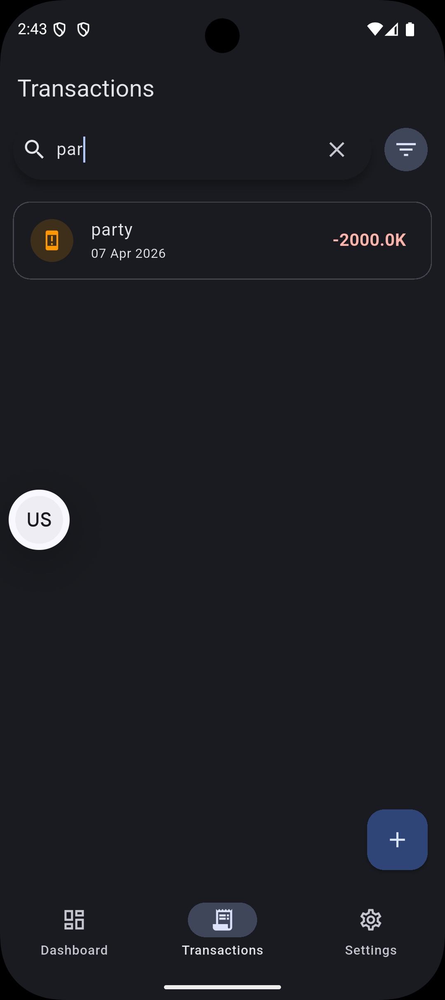
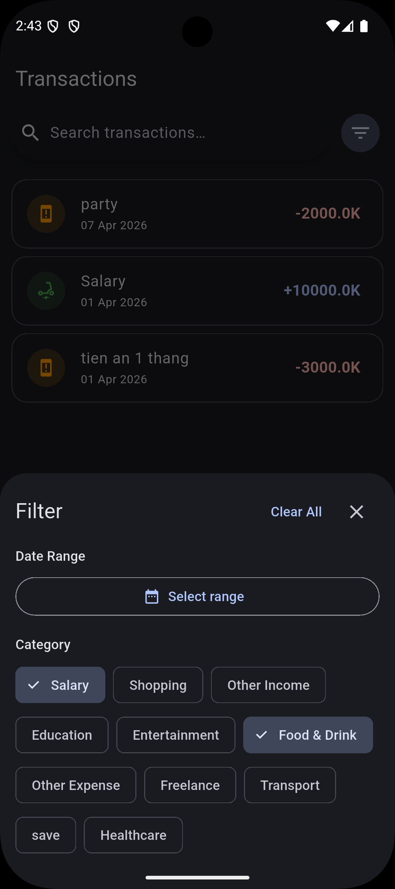
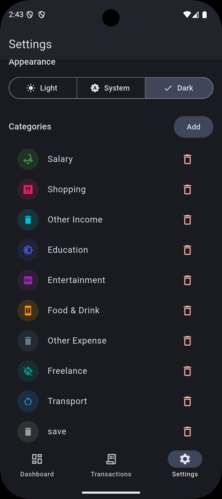
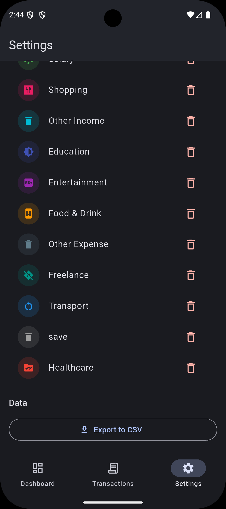

# Expense Tracker — Product Documentation

**Version**: 1.1.0  
**Platform**: iOS · Android  
**Last Updated**: 2026-04-06  
**Status**: Production-ready

---

## Table of Contents

1. [Tổng quan sản phẩm](#1-tổng-quan-sản-phẩm)
2. [Tính năng](#2-tính-năng)
3. [Kiến trúc hệ thống](#3-kiến-trúc-hệ-thống)
4. [Cấu trúc dữ liệu](#4-cấu-trúc-dữ-liệu)
5. [Cấu trúc thư mục](#5-cấu-trúc-thư-mục)
6. [Tech Stack & Dependencies](#6-tech-stack--dependencies)
7. [Luồng dữ liệu (Data Flow)](#7-luồng-dữ-liệu-data-flow)
8. [Quy tắc lập trình](#8-quy-tắc-lập-trình)
9. [Hướng dẫn cài đặt & chạy](#9-hướng-dẫn-cài-đặt--chạy)
10. [Known Issues & Workarounds](#10-known-issues--workarounds)
11. [Roadmap](#11-roadmap)

---

## 1. Tổng quan sản phẩm

**Expense Tracker** là ứng dụng quản lý chi tiêu cá nhân hoạt động **hoàn toàn offline**, được xây dựng bằng Flutter với kiến trúc MVVM. Người dùng có thể ghi lại thu nhập và chi tiêu hàng ngày, phân loại theo danh mục, xem báo cáo trực quan, tìm kiếm và lọc giao dịch, và xuất dữ liệu ra file CSV.

### Điểm nổi bật

| Tiêu chí | Chi tiết |
|----------|----------|
| **Offline-first** | Toàn bộ dữ liệu lưu cục bộ bằng Isar DB, không cần kết nối mạng |
| **Material Design 3** | Giao diện theo chuẩn M3, hỗ trợ Dynamic Color và Dark Mode |
| **Reactive UI** | Dashboard và danh sách cập nhật tức thì khi thêm/sửa/xoá giao dịch |
| **Đơn người dùng** | Thiết kế cho một thiết bị, một người dùng — không cần đăng nhập |
| **Tiền tệ mặc định** | VND (Vietnamese Dong) |

---

### 1.1 Demo

> Xem toàn bộ luồng sử dụng trong một đoạn demo ngắn:

<p align="center">
  
</p>

---

#### Dashboard

| Ngày | Tuần | Tháng |
|------|------|-------|
|  |  |  |

---

#### Giao dịch

| Danh sách | Thêm giao dịch | Tìm kiếm | Lọc |
|-----------|----------------|----------|-----|
|  |  |  |  |

---

#### Cài đặt & Xuất CSV

| Cài đặt | Xuất CSV |
|---------|----------|
|  |  |

---

## 2. Tính năng

### 2.1 Quản lý giao dịch (US1 — P1)

Tính năng cốt lõi của ứng dụng. Người dùng có thể:

- **Thêm** giao dịch với các trường: Số tiền, Ngày, Loại (Thu/Chi), Danh mục, Ghi chú
- **Sửa** bất kỳ trường nào của giao dịch đã tồn tại
- **Xoá** giao dịch với hộp thoại xác nhận (swipe-to-delete hoặc mở form)
- **Xem danh sách** giao dịch sắp xếp theo ngày mới nhất, hiển thị icon danh mục và màu sắc thu/chi

**Validation**: Số tiền phải là số dương, khác 0. Phải chọn danh mục trước khi lưu.

**Màn hình**: `TransactionListScreen` + `AddEditTransactionSheet` (Modal Bottom Sheet)

---

### 2.2 Phân loại danh mục (US2 — P2)
flutter analyze → No issues found!
- **11 danh mục mặc định** được seed tự động khi mở app lần đầu:

  | Loại | Danh mục |
    |------|----------|
  | Chi tiêu | Food & Drink · Transport · Shopping · Healthcare · Entertainment · Education · Other Expense |
  | Thu nhập | Salary · Freelance · Other Income |
  | Chung | Uncategorized (fallback) |

- **Thêm danh mục tuỳ chỉnh** qua màn hình Settings
- **Xoá danh mục**: Các giao dịch thuộc danh mục bị xoá sẽ tự động chuyển sang "Uncategorized" (sau khi xác nhận)
- **Bộ chọn danh mục**: Lọc theo loại giao dịch — danh sách danh mục thu nhập hoặc chi tiêu hiển thị phù hợp

---

### 2.3 Dashboard với biểu đồ (US3 — P3)

Dashboard hiển thị tổng quan tài chính cho khoảng thời gian đã chọn:

- **3 chỉ số tóm tắt**: Tổng thu nhập · Tổng chi tiêu · Số dư (thu − chi)
- **Biểu đồ tròn (Pie Chart)**: Phân tích chi tiêu theo danh mục, hiển thị % và legend
- **Bộ chọn kỳ**: Ngày / Tuần / Tháng — cập nhật tức thì khi chuyển đổi
- **Empty state**: Hiển thị placeholder khi không có giao dịch trong kỳ đã chọn
- **Phản ứng tức thì**: Khi thêm/sửa/xoá giao dịch ở tab Transactions, Dashboard tự cập nhật

---

### 2.4 Tìm kiếm & Lọc (US4 — P4)

- **Tìm kiếm**: Gõ vào SearchBar — kết quả lọc theo nội dung ghi chú (note), debounce 300ms
- **Lọc theo khoảng thời gian**: Picker chọn ngày bắt đầu và kết thúc
- **Lọc theo danh mục**: Chọn một hoặc nhiều danh mục cùng lúc
- **Kết hợp tiêu chí**: Tìm kiếm + lọc ngày + lọc danh mục hoạt động đồng thời (AND)
- **Xoá bộ lọc**: Nút "Clear All" đặt lại tất cả về trạng thái không lọc
- **Badge đếm**: Icon bộ lọc hiển thị số tiêu chí đang active

---

### 2.5 Light / Dark Mode (US5 — P5)

- **3 chế độ**: Light · Dark · System (theo cài đặt hệ điều hành)
- **Áp dụng ngay lập tức**: Không cần khởi động lại app
- **Lưu bền vững**: Chế độ được lưu vào Isar DB, khôi phục chính xác khi mở lại app — không có hiện tượng nhấp nháy (flash)
- **Dynamic Color**: Trên Android 12+, màu sắc theo Wallpaper của thiết bị (Material You)
- **Fallback**: Trên thiết bị không hỗ trợ Dynamic Color, dùng seed màu xanh lá (#4CAF50)

---

### 2.6 Xuất CSV (US6 — P6)

- **Trigger**: Nút "Export to CSV" trong màn hình Settings
- **Nội dung file**: Header row + tất cả giao dịch đang hiển thị (tôn trọng bộ lọc đang active)
- **Cột**: `Date · Type · Category · Amount · Note`
- **Đường dẫn**: Thư mục Documents của thiết bị (`getApplicationDocumentsDirectory()`)
- **Tên file**: `expense_tracker_YYYYMMDD_HHmmss.csv`
- **Quyền Android**: Yêu cầu `MANAGE_EXTERNAL_STORAGE` trước khi ghi (Android runtime permission)
- **Phản hồi người dùng**: SnackBar hiển thị đường dẫn đầy đủ khi thành công, thông báo lỗi khi thất bại
- **Dọn dẹp lỗi**: File tạm bị xoá nếu ghi thất bại (không để lại file rỗng)

---

### 2.7 Bảo mật & Quyền truy cập (US7 — P7)

- **Quản lý quyền**: Luôn sử dụng package `permission_handler` cho mọi quyền truy cập runtime (ví dụ: ghi file, truy cập bộ nhớ ngoài).
- **Trải nghiệm người dùng**: Luôn giải thích lý do xin quyền (rationale) trước khi yêu cầu hoặc khi bị từ chối (Denied/Permanently Denied). Không được yêu cầu quyền mà không có giải thích rõ ràng.
- **Tuân thủ nền tảng**: Đảm bảo mọi quyền truy cập đều tuân thủ chính sách của Android/iOS. Không tự ý truy cập khi chưa được cấp quyền.

---

## 3. Kiến trúc hệ thống

Ứng dụng tuân theo kiến trúc **MVVM (Model-View-ViewModel)** kết hợp với **Repository Pattern**.

```
┌──────────────────────────────────────────────────────────────┐
│                        VIEW LAYER                            │
│  DashboardScreen · TransactionListScreen · SettingsScreen    │
│  AddEditTransactionSheet · Shared Widgets                    │
│  (HookConsumerWidget / ConsumerWidget — NO business logic)   │
└──────────────────────┬───────────────────────────────────────┘
                       │ watch / read providers
┌──────────────────────▼───────────────────────────────────────┐
│                    VIEWMODEL LAYER                           │
│  TransactionViewModel · DashboardViewModel · ThemeViewModel  │
│  (AsyncNotifier / Notifier — ALL business logic here)        │
└──────────────────────┬───────────────────────────────────────┘
                       │ calls repository methods
┌──────────────────────▼───────────────────────────────────────┐
│                   REPOSITORY LAYER                          │
│  TransactionRepository · CategoryRepository                  │
│  SettingsRepository                                          │
│  (ONLY layer that imports Isar)                              │
└──────────────────────┬───────────────────────────────────────┘
                       │ read/write collections
┌──────────────────────▼───────────────────────────────────────┐
│                     MODEL LAYER                              │
│  TransactionModel · CategoryModel · SettingsModel            │
│  (@Collection — Isar schemas, auto-generated .g.dart)        │
└──────────────────────────────────────────────────────────────┘
```

### Nguyên tắc kiến trúc bất biến

| Quy tắc | Ý nghĩa |
|---------|---------|
| Widget không import Isar | Mọi truy cập DB đi qua Repository → ViewModel → Provider |
| Logic chỉ trong ViewModel | Widget build method không chứa `map`, `fold`, `sort` hay logic nghiệp vụ |
| Reactive state | `TransactionViewModel` watch stream Isar → UI tự rebuild |
| Provider là nguồn sự thật | Không dùng `setState` cho shared state; mọi state qua Riverpod |

### State Management Flow

```
IsarDatabase.watchAll() ──stream──► TransactionViewModel.build()
                                              │
                              ┌───────────────▼──────────────────┐
                              │  TransactionState {              │
                              │    all: [...],                   │
                              │    filtered: [...],              │  ◄── FilterProviders
                              │    totalIncome, totalExpense,    │      (search, date, category)
                              │    balance                       │
                              │  }                               │
                              └───────────────┬──────────────────┘
                                              │ ref.watch
                         ┌────────────────────┼────────────────────┐
                         ▼                    ▼                    ▼
               TransactionListScreen   DashboardViewModel   SettingsScreen
                    (list + FAB)       (period filter +     (CSV export uses
                                        chart data)          filtered list)
```

---

## 4. Cấu trúc dữ liệu

### 4.1 TransactionModel

```dart
@collection
class TransactionModel {
  Id id = Isar.autoIncrement;   // Auto-generated integer PK
  late double amount;            // Số tiền (> 0)
  @Index() late DateTime date;   // Ngày giao dịch (timezone thiết bị)
  @Index() late String categoryId; // FK → CategoryModel.id (slug)
  String note = '';              // Ghi chú (tuỳ chọn)
  @Index() late bool isIncome;   // true = Thu nhập, false = Chi tiêu
}
```

**Index**: `date`, `categoryId`, `isIncome` được đánh index để tối ưu truy vấn lọc.

---

### 4.2 CategoryModel

```dart
@collection
class CategoryModel {
  Id get isarId => fastHash(id);  // Deterministic int từ string id
  late String id;        // Slug (e.g., 'food', 'salary', 'custom_coffee')
  late String name;      // Tên hiển thị (e.g., 'Food & Drink')
  late String icon;      // Hex code point Material Icons (e.g., 'e56c')
  late int colorValue;   // ARGB integer (e.g., 0xFFFF9800 cho màu cam)
  bool isDefault = false; // true = không cho phép xoá từ UI
}
```

**ID strategy**: Dùng FNV-1a hash (hàm `fastHash`) để chuyển string id thành `int` cho Isar — đảm bảo tính nhất quán khi tham chiếu từ Transaction.

**Default categories (seed)**:

```
ID              Name             Icon     Color
─────────────────────────────────────────────────
uncategorized   Uncategorized    e8ef     Grey
food            Food & Drink     e56c     Orange
transport       Transport        e531     Blue
shopping        Shopping         e8cc     Pink
healthcare      Healthcare       e548     Red
entertainment   Entertainment    e02c     Purple
education       Education        e80c     Indigo
other_expense   Other Expense    e8b8     Blue Grey
salary          Salary           e227     Green
freelance       Freelance        e8d5     Teal
other_income    Other Income     e8b8     Cyan
```

---

### 4.3 SettingsModel

```dart
@collection
class SettingsModel {
  Id id = 0;               // Luôn bằng 0 — singleton record
  String themeMode = 'system'; // 'light' | 'dark' | 'system'
}
```

**Singleton pattern**: Chỉ tồn tại đúng 1 record trong collection, với `id = 0`. `SettingsRepository` tự tạo record mặc định nếu chưa có.

---

### 4.4 Quan hệ giữa các Model

```
CategoryModel (1) ──────────── (n) TransactionModel
    id (String slug)             categoryId (String FK)

SettingsModel — singleton, không quan hệ với model khác
```

---

## 5. Cấu trúc thư mục

```
lib/
├── main.dart                              # App entry: ProviderScope, Isar init, MaterialApp
│
├── core/
│   ├── database/
│   │   └── isar_database.dart             # Singleton Isar.open(), gọi trước runApp
│   ├── theme/
│   │   └── app_theme.dart                 # AppTheme.light() + AppTheme.dark() — M3
│   └── utils/
│       └── csv_export_service.dart        # Static export function, ExportException
│
├── data/
│   ├── models/
│   │   ├── transaction_model.dart         # @collection + .g.dart
│   │   ├── category_model.dart            # @collection + fastHash + CategoryModelFactory
│   │   └── settings_model.dart            # @collection singleton
│   └── repositories/
│       ├── transaction_repository.dart    # CRUD + watchAll() stream + reassignCategory()
│       ├── category_repository.dart       # seedDefaults() + deleteAndReassign()
│       └── settings_repository.dart       # getSettings() + saveThemeMode()
│
├── features/
│   ├── dashboard/
│   │   ├── viewmodels/
│   │   │   └── dashboard_view_model.dart  # Notifier<DashboardSummary>, period filter
│   │   └── views/
│   │       └── dashboard_screen.dart      # PieChart + summary cards + period selector
│   │
│   ├── transaction/
│   │   ├── viewmodels/
│   │   │   └── transaction_view_model.dart # AsyncNotifier<TransactionState>, CRUD + filter
│   │   └── views/
│   │       ├── transaction_list_screen.dart    # ListView + swipe-to-delete + FAB + search
│   │       └── add_edit_transaction_sheet.dart # ModalBottomSheet form
│   │
│   └── settings/
│       ├── viewmodels/
│       │   └── theme_view_model.dart      # AsyncNotifier<ThemeMode>, persist to Isar
│       └── views/
│           └── settings_screen.dart       # Theme toggle + category management + CSV export
│
└── shared/
    ├── providers/
    │   ├── database_provider.dart         # isarProvider + 3 repo providers (NO ViewModel imports)
    │   ├── transaction_providers.dart     # transactionVMProvider
    │   ├── category_providers.dart        # categoryListProvider (StreamProvider)
    │   ├── dashboard_providers.dart       # dashboardVMProvider + selectedPeriodProvider
    │   ├── filter_providers.dart          # searchQueryProvider, dateRangeFilterProvider, categoryFilterProvider
    │   └── settings_providers.dart        # themeVMProvider
    └── widgets/
        ├── app_card_widget.dart           # M3 Card wrapper — no magic numbers
        ├── category_picker_widget.dart    # FilterChip list, lọc theo isIncome
        ├── confirm_dialog_widget.dart     # Reusable AlertDialog với static show()
        ├── filter_bottom_sheet.dart       # Date range + category multi-filter
        └── search_bar_widget.dart         # M3 SearchBar với debounce 300ms
```

**Quy tắc import (bắt buộc)**:
- `lib/shared/providers/database_provider.dart` là file DUY NHẤT chứa tất cả repository providers, không import ViewModel → không circular dependency
- ViewModel files import từ `database_provider.dart` để lấy repo providers
- Feature-level `*_providers.dart` files import ViewModel classes và re-export từ `database_provider.dart`

---

## 6. Tech Stack & Dependencies

### Runtime Dependencies

| Package | Version | Mục đích |
|---------|---------|---------|
| `hooks_riverpod` | ^2.6.1 | State management — Provider + Notifier pattern |
| `flutter_hooks` | ^0.21.1 | Hooks cho ephemeral state (useState, useTextEditingController…) |
| `isar` | ^3.1.0+1 | Embedded NoSQL database (local, offline, reactive streams) |
| `isar_flutter_libs` | ^3.1.0+1 | Native binaries cho Isar trên iOS/Android |
| `path_provider` | ^2.1.4 | Lấy đường dẫn thư mục Documents/App |
| `fl_chart` | ^0.70.2 | Vẽ biểu đồ tròn (PieChart) cho Dashboard |
| `dynamic_color` | ^1.7.0 | Material You Dynamic Color từ wallpaper hệ thống |
| `csv` | ^6.0.0 | Sinh chuỗi CSV từ List<List> |
| `permission_handler` | ^11.3.1 | Runtime permission cho storage trên Android |
| `intl` | ^0.20.2 | Định dạng ngày tháng và số tiền (DateFormat, NumberFormat) |

### Dev Dependencies

| Package | Version | Mục đích |
|---------|---------|---------|
| `flutter_lints` | ^6.0.0 | Lint rules bắt buộc |
| `isar_generator` | ^3.1.0+1 | Sinh file `*.g.dart` cho Isar schema |
| `build_runner` | ^2.4.13 | Chạy code generation |

### Yêu cầu nền tảng

| Platform | Min Version | Ghi chú |
|----------|------------|---------|
| Flutter SDK | Latest stable | Dart ^3.11.1 |
| Android | API 21 (Android 5.0) | Permission handler API 33+ cho MANAGE_EXTERNAL_STORAGE |
| iOS | iOS 12+ | Không cần xin quyền storage |
| AGP | 8.x | Yêu cầu namespace patch (xem mục 10) |

---

## 7. Luồng dữ liệu (Data Flow)

### 7.1 Khởi động ứng dụng

```
main() 
  ├── WidgetsFlutterBinding.ensureInitialized()
  ├── IsarDatabase.init()           ← Mở Isar DB, đăng ký 3 schemas
  └── runApp(ProviderScope(
         child: ExpenseTrackerApp()
       ))
       │
       └── ExpenseTrackerApp (ConsumerWidget)
             ├── ref.watch(themeVMProvider)     ← Đọc ThemeMode từ Isar Settings
             └── DynamicColorBuilder
                   └── MaterialApp(themeMode, theme, darkTheme)
                         └── _AppShell (NavigationBar + 3 screens)
```

### 7.2 Thêm giao dịch mới

```
Người dùng gõ form → Nhấn "Add Transaction"
  │
  ▼
AddEditTransactionSheet.save()
  ├── Validate amount > 0
  ├── Validate category selected
  └── ref.read(transactionVMProvider.notifier).addTransaction(model)
        │
        ▼
  TransactionViewModel.addTransaction()
        │
        ▼
  TransactionRepository.add(model)   ← writeTxn to Isar
        │
        ▼
  Isar stream emits new list
        │
        ▼
  TransactionViewModel (stream listener) → rebuilds TransactionState
        │
  ┌─────┴──────────────────────────┐
  ▼                                ▼
TransactionListScreen          DashboardViewModel
(list cập nhật ngay)           (summary cập nhật ngay)
```

### 7.3 Lọc & Tìm kiếm

```
Người dùng gõ SearchBar (debounce 300ms)
  │
  ▼
searchQueryProvider.state = query
  │
  ▼
TransactionViewModel ref.listen(searchQueryProvider) → _refresh()
  │
  ▼
_compute(all, query, dateRange, categoryIds) → filtered list
  │
  ▼
TransactionListScreen.build() nhận state mới → re-render list
```

### 7.4 Chuyển đổi Dark Mode

```
SettingsScreen SegmentedButton → onSelectionChanged('dark')
  │
  ▼
ref.read(themeVMProvider.notifier).setThemeMode('dark')
  │
  ├── SettingsRepository.saveThemeMode('dark')  ← writeTxn Isar Settings
  └── state = AsyncData(ThemeMode.dark)
        │
        ▼
  ExpenseTrackerApp.build() ref.watch(themeVMProvider)
        │
        ▼
  MaterialApp(themeMode: ThemeMode.dark) → toàn bộ app đổi ngay
```

---

## 8. Quy tắc lập trình

### 8.1 Quy ước đặt tên

| Đối tượng | Convention | Ví dụ |
|-----------|-----------|-------|
| File | `snake_case` | `transaction_list_screen.dart` |
| Class | `PascalCase` | `TransactionViewModel` |
| Variable / Method | `camelCase` | `totalExpense`, `fetchCategories()` |
| Constant | `camelCase` (Dart) | `maxRetries` |
| Provider | `camelCase` + `Provider` suffix | `transactionVMProvider` |

### 8.2 Widget guidelines

```dart
// ✅ ĐÚNG — HookConsumerWidget cho widget cần hooks + riverpod
class MyScreen extends HookConsumerWidget {
  @override
  Widget build(BuildContext context, WidgetRef ref) {
    final ctrl = useTextEditingController(); // flutter_hooks
    final data = ref.watch(myProvider);      // riverpod
    ...
  }
}

// ✅ ĐÚNG — ConsumerWidget khi không cần hooks
class MyCard extends ConsumerWidget { ... }

// ❌ SAI — StatefulWidget bị cấm (trừ trường hợp bắt buộc có comment lý do)
class MyWidget extends StatefulWidget { ... }
```

### 8.3 Màu sắc

```dart
// ✅ ĐÚNG — dùng colorScheme tokens
color: Theme.of(context).colorScheme.primary
backgroundColor: cs.surfaceContainerHighest

// ❌ SAI — hardcoded color (chỉ được phép trong app_theme.dart)
color: Colors.blue
color: Color(0xFF1976D2)
```

### 8.4 Logic trong ViewModel, không trong Widget

```dart
// ✅ ĐÚNG — tính toán trong ViewModel
class TransactionViewModel extends AsyncNotifier<TransactionState> {
  static TransactionState _compute(List<TransactionModel> all, ...) {
    final income = all.where((t) => t.isIncome).fold(0.0, (s, t) => s + t.amount);
    ...
  }
}

// Widget chỉ hiển thị:
Text(state.balance.toString())

// ❌ SAI — logic trong Widget build()
final income = transactions.where((t) => t.isIncome).fold(...);
```

### 8.5 Import discipline

```dart
// ✅ Widget chỉ import providers và widgets
import '../../../shared/providers/transaction_providers.dart';
import '../../../shared/widgets/confirm_dialog_widget.dart';

// ❌ Widget KHÔNG được import isar hay repository trực tiếp
import 'package:isar/isar.dart';           // CẤMTUYỆT ĐỐI trong widget
import '../../../data/repositories/...';   // CẤMTUYỆT ĐỐI trong widget
```

### 8.6 Bảo mật & Quyền truy cập

- Luôn sử dụng package `permission_handler` cho mọi quyền runtime.
- Trước khi xin quyền hoặc khi bị từ chối, phải giải thích lý do rõ ràng cho người dùng (rationale dialog/snackbar/toast).
- Không được bypass hoặc hardcode quyền truy cập.

---

## 9. Hướng dẫn cài đặt & chạy

### 9.1 Yêu cầu môi trường

```bash
flutter --version   # >= Latest stable
dart --version      # >= 3.11.1
```

### 9.2 Cài đặt

```bash
# Clone hoặc mở project
cd expense_tracker

# Cài đặt dependencies
flutter pub get

# Sinh code Isar (bắt buộc sau khi thay đổi Model)
dart run build_runner build --delete-conflicting-outputs
```

### 9.3 Chạy ứng dụng

```bash
# iOS Simulator
flutter run -d ios

# Android Emulator / Device
flutter run -d android

# Kiểm tra lỗi trước khi build
flutter analyze lib/
```

### 9.4 Build release

```bash
# Android APK
flutter build apk --release

# Android App Bundle (khuyến nghị cho Play Store)
flutter build appbundle --release

# iOS IPA (cần Xcode và Apple Developer account)
flutter build ipa --release
```

### 9.5 Khi thay đổi Isar Model

Sau bất kỳ thay đổi nào trong `lib/data/models/*.dart`:

```bash
dart run build_runner build --delete-conflicting-outputs
```

> ⚠️ Nếu thay đổi schema gây breaking change (thêm/xoá field bắt buộc), cần xử lý migration hoặc xoá DB cũ trước khi chạy.

---

## 10. Known Issues & Workarounds

### 10.1 isar_flutter_libs + AGP 8.x — Namespace missing

**Lỗi**:
```
A problem occurred configuring project ':isar_flutter_libs'.
> Namespace not specified.
```

**Nguyên nhân**: `isar_flutter_libs 3.1.0+1` được build cho AGP 7.x, không có khai báo `namespace` trong `build.gradle`.

**Fix đã áp dụng** (`android/build.gradle.kts`):

```kotlin
// Đặt TRƯỚC subprojects { project.evaluationDependsOn(":app") }
subprojects {
    plugins.withId("com.android.library") {
        the<com.android.build.gradle.LibraryExtension>().apply {
            if (namespace.isNullOrEmpty()) {
                namespace = project.group
                    .toString()
                    .ifEmpty { "com.placeholder.${project.name.replace("-", "_")}" }
            }
        }
    }
}
```

**Lý do dùng `plugins.withId` thay vì `afterEvaluate`**: `evaluationDependsOn(":app")` làm cho subprojects được evaluate sớm → `afterEvaluate` sẽ ném lỗi "project is already evaluated". `plugins.withId` chạy tại thời điểm plugin được apply — trước khi evaluate — nên tránh được vấn đề này.

---

### 10.2 Isar DB Schema Migration

Isar 3.x không tự động migrate schema khi thêm/xoá field. Nếu cần thay đổi model sau khi đã có dữ liệu:

**Giải pháp ngắn hạn (development)**:
```bash
# Xoá DB file và chạy lại
adb shell rm -rf /data/data/com.example.expense_tracker/files/
flutter run
```

**Giải pháp production**: Sử dụng Isar schema migration hooks (xem tài liệu Isar 4.x khi stable).

---

### 10.3 CSV Export trên Android 13+

Trên Android 13 (API 33+), `MANAGE_EXTERNAL_STORAGE` bị giới hạn bởi Google Play Policy. App hiện tại dùng `getApplicationDocumentsDirectory()` — thư mục private của app, không cần `MANAGE_EXTERNAL_STORAGE` trên iOS. Trên Android, file vẫn accessible qua Files app.

**Nếu cần export ra thư mục Download**:
- Dùng `MediaStore` API (Android-specific) thay vì `path_provider`
- Hoặc dùng package `share_plus` để chia sẻ file thay vì lưu trực tiếp

---

## 11. Roadmap

### v1.1 — Cải thiện UX
- [ ] Swipe navigation giữa các kỳ trong Dashboard (tuần trước, tháng trước)
- [ ] Recurring transactions (giao dịch định kỳ)
- [ ] Quick add từ notification hoặc widget màn hình chính
- [ ] Haptic feedback khi swipe-to-delete

### v1.2 — Tính năng nâng cao
- [ ] Đặt ngân sách (Budget) theo danh mục và kỳ
- [ ] Cảnh báo khi chi tiêu vượt budget
- [ ] Nhiều loại tiền tệ (multi-currency)
- [ ] Import CSV / sao lưu & phục hồi

### v2.0 — Cloud Sync (optional)
- [ ] Đăng nhập tùy chọn (Google/Apple Sign-In)
- [ ] Đồng bộ đa thiết bị qua Supabase hoặc Firebase
- [ ] Chia sẻ dữ liệu giữa các thành viên trong gia đình

### Technical debt
- [ ] Nâng cấp lên Isar 4.x (khi stable) — hỗ trợ AGP 8.x native, schema migration
- [ ] Widget tests cho các màn hình chính
- [ ] Dependency injection rõ ràng hơn bằng Riverpod code generation (`@riverpod`)

---

## Phụ lục

### A. Sơ đồ Provider Dependencies

```
isarProvider
  ├── transactionRepoProvider  ──► transactionVMProvider ──► TransactionListScreen
  │                            └── (stream) ──► DashboardViewModel ──► DashboardScreen
  ├── categoryRepoProvider     ──► categoryListProvider ──► CategoryPickerWidget
  │                                                      └── FilterBottomSheet
  └── settingsRepoProvider     ──► themeVMProvider ──► ExpenseTrackerApp (themeMode)

filterProviders (searchQueryProvider, dateRangeFilterProvider, categoryFilterProvider)
  └── transactionVMProvider.listen() ──► _refresh() ──► TransactionState.filtered
```

### B. Cấu trúc TransactionState

```dart
class TransactionState {
  final List<TransactionModel> all;       // Toàn bộ giao dịch (unfiltered)
  final List<TransactionModel> filtered;  // Sau khi áp dụng search + filter
  final double totalIncome;               // Tổng thu (tính từ `all`)
  final double totalExpense;              // Tổng chi (tính từ `all`)
  final double balance;                   // totalIncome - totalExpense
}
```

### C. Cấu trúc DashboardSummary

```dart
class DashboardSummary {
  final double totalIncome;                    // Thu nhập trong kỳ
  final double totalExpense;                   // Chi tiêu trong kỳ
  final double balance;                        // Số dư trong kỳ
  final List<CategoryAmount> categoryBreakdown; // Danh sách {category, amount} cho chart
  final bool isEmpty;                          // true nếu không có giao dịch trong kỳ
}
```

### D. Changelog

| Version | Date | Changes |
|---------|------|---------|
| 1.0.0 | 2026-04-06 | Initial release — 6 user stories, 43 tasks implemented |

---

*Tài liệu này được tạo tự động từ spec và implementation. Cập nhật khi có thay đổi kiến trúc hoặc tính năng mới.*

## 4. Security & Permissions

### Permission Management
- **Bắt buộc sử dụng** package [`permission_handler`](https://pub.dev/packages/permission_handler) cho mọi thao tác xin quyền hệ thống (ví dụ: ghi file, truy cập bộ nhớ).
- Không được sử dụng các API native hoặc package khác để xin quyền mà bỏ qua permission_handler.

### User Experience
- **Giải thích lý do xin quyền (Rationale):** Trước khi hiện dialog xin quyền, luôn phải hiện một màn giải thích ngắn gọn cho người dùng về lý do cần quyền đó (ví dụ: "Ứng dụng cần quyền truy cập bộ nhớ để xuất file CSV").
- **Xử lý trường hợp bị từ chối:** Nếu người dùng từ chối (Denied) hoặc từ chối vĩnh viễn (Permanently Denied), phải hiện thông báo rõ ràng, hướng dẫn cách cấp lại quyền trong Settings nếu cần thiết.
- Không được crash app hoặc ẩn tính năng mà không thông báo lý do cho người dùng.

### Implementation Rules
- Tất cả logic kiểm tra, xin quyền, và xử lý kết quả phải nằm trong ViewModel hoặc Service, không được viết trực tiếp trong Widget.
- Khi cần quyền, flow chuẩn:
  1. Kiểm tra trạng thái quyền hiện tại.
  2. Nếu chưa được cấp, hiện rationale (giải thích).
  3. Sau khi người dùng đồng ý, mới gọi permission_handler để xin quyền.
  4. Nếu bị từ chối, hiện thông báo và hướng dẫn mở Settings nếu cần.
- Không được gọi trực tiếp các API ghi file/export nếu chưa được cấp quyền.

### Example (pseudo-code)
```dart
Future<void> exportCsv(BuildContext context) async {
  final status = await Permission.storage.status;
  if (!status.isGranted) {
    // Hiện dialog giải thích lý do
    final shouldRequest = await showRationaleDialog(context);
    if (!shouldRequest) return;
    final result = await Permission.storage.request();
    if (!result.isGranted) {
      // Hiện thông báo lỗi và hướng dẫn mở Settings nếu cần
      showPermissionDeniedDialog(context, result.isPermanentlyDenied);
      return;
    }
  }
  // Được quyền, tiếp tục export CSV
  await doExportCsv();
}
```
